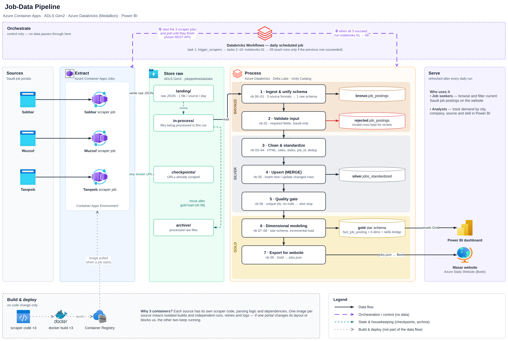

# Masar — Saudi Job-Market Data Pipeline


https://abdallah-sami.github.io/Job_Data_pipeline/

An end-to-end data engineering pipeline that collects Saudi job postings from three portals every day,
cleans and models them in a Medallion lakehouse on Azure Databricks, and serves them through the
**Masar** website and a **Power BI** dashboard.



## How it works

1. **Orchestrate** — one scheduled Databricks job runs daily.
   Task 1 (`trigger_scrapers`) starts the scrapers and waits; tasks 2–11 run notebooks `00 → 09` in order.
2. **Extract** — three scrapers (Sabbar, Wuzzuf, Tanqeeb), each its own Docker image, run as
   **Azure Container Apps Jobs**. They scrape incrementally (a checkpoint of seen URLs) and write raw JSON
   to the `landing` container in ADLS Gen2 — never directly to Databricks.
3. **Store** — ADLS Gen2 (`jobpipelinedatalake`): `landing/` → `in-process/` → `archive/`, plus `checkpoints/`.
4. **Process** — seven stages across Bronze, Silver and Gold (see [`databricks/README.md`](databricks/README.md)),
   with two quality gates: invalid input rows go to `rejected.job_postings`, and a strict assert-based gate
   stops the job before bad data reaches Gold.
5. **Serve** — Gold star schema (`fact_job_posting` + 6 dimensions + skills bridge) feeds Power BI;
   notebook 09 writes `jobs.json` to the `$web` static website.

## Repository layout

```
scrapers/
  sabbar/      Playwright scraper + Dockerfile + requirements
  wuzzuf/      requests scraper + Dockerfile + requirements
  tanqeeb/     requests scraper + Dockerfile + requirements
databricks/    trigger_scrapers + notebooks 00–09
website/       Masar static site
tools/         maintenance scripts (checkpoint rebuild, file check)
docs/          architecture diagram (.drawio + .png)
```

## Configuration

All secrets come from the environment — nothing is hard-coded.

- **Scrapers:** see [`.env.example`](.env.example). In Azure, set them as secrets on each Container Apps Job.
- **Databricks:** credentials live in the secret scope `job-pipeline` (setup in [`databricks/README.md`](databricks/README.md)).

## Build and deploy a scraper

```bash
az acr build --registry <acr-name> --image tanqeeb-scraper:latest scrapers/tanqeeb
```

Then point the Container Apps Job at the new image. Docker and the registry are build-time only —
they are not part of the daily data flow.

## Run a scraper locally (PowerShell)

```powershell
$env:AZURE_STORAGE_CONNECTION = "<connection string>"
$env:MAX_JOBS_PER_RUN = "0"
python scrapers/tanqeeb/tanqeeb_scraper_cloud.py
```

Output goes to the same `landing` container the cloud jobs use. The Tanqeeb scraper writes its landing
file with every batch, before updating the checkpoint, so an interrupted run never loses data.

## Maintenance tools

- `tools/check_tanqeeb_files.py` — lists Tanqeeb files in `landing` and `archive` with record counts.
- `tools/rebuild_checkpoint.py` — rebuilds the Tanqeeb checkpoint from the files actually stored
  (use it if the checkpoint ever gets ahead of the data).

## Team

[Team member names] · Supervisor: [Supervisor name]
